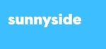
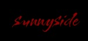
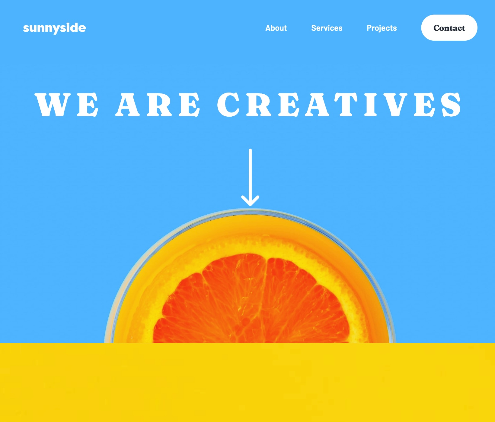
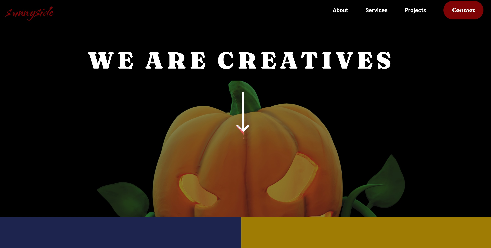

    <h1>Sunnyside</h1>
    <h2>Dark-mode Edition Halloween</h2>
    

        Welcome to the Sunnyside project! This endeavor serves as a learning exercise, putting HTML, CSS, and Sass skills into action while exploring concepts like B.E.M. and achieving "pixel-perfect" integration.
    

<section align="center">
    <h2>Features at a Glance</h2>
    <article>
        <h3>Dark Mode 🌙</h3>
        

            Dive into the shadows with an all-new dark mode. Activate it by clicking on the Sunnyside logo in the top-left corner. Enjoy a more comfortable browsing experience during the night.
        

        
        
    </article>
    <article>
        <h3>Halloween Design 🎃</h3>
        

            I've added a special touch to the design to celebrate Halloween. Explore spooky elements, mysterious colors, and a festive atmosphere to get into the spirit of the season.
        

    </article>
</section>
<section align="center">
    

        

          Light or Dark mode ? 
        

        

            Change the design by clicking on the "Sunnyside" logo.
        

        

          
            
        

    

</section>
<section align="center">
    <h2>Languages used</h2>
    
    
    
</section>
<section align="center">
    <h2>Author</h2>
    <cite>Steeve Zych </cite>
    <a href="https://github.com/steeve0403" style="display: flex; justify-content: center">
        <i class="fa-brands fa-github-alt fa-2x"></i>
    </a>
</section>

---

*This project was created as part of the learning process at [BeCode](https://becode.org/).*
<link rel="stylesheet" href="https://cdnjs.cloudflare.com/ajax/libs/font-awesome/6.0.0/css/all.min.css" integrity="sha512-..." crossorigin="anonymous" />

